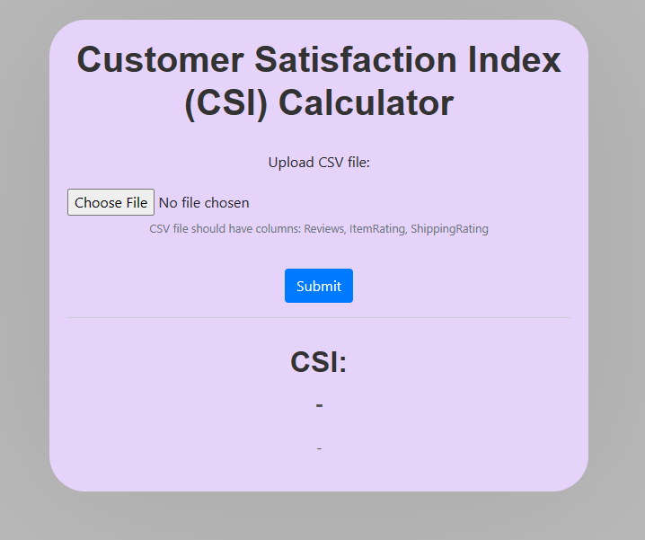
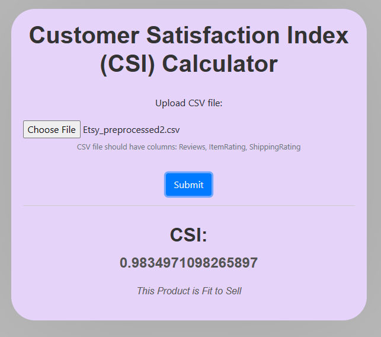

# Etsy Customer Satisfaction Index (CSI) Analyzer

A Flask-based web application that analyzes Etsy product reviews to calculate a Customer Satisfaction Index (CSI) using sentiment analysis (RoBERTa) and weighted scoring.

## 📋 Table of Contents
- [Overview](#-overview)
- [Screenshots](#-screenshots)
- [How to Use](#-how-to-use)
- [How It Works](#-how-it-works)
- [Tech Stack](#-tech-stack)
- [Installation](#-installation)
- [Project Structure](#-project-structure)
- [Dependencies](#-dependencies)
- [Contributing](#-contributing)
- [License](#-license)

## 🎯 Overview

Etsy CSI Analyzer is an intelligent web application designed to help sellers, buyers, and platform owners make data-driven decisions about product viability. By analyzing customer reviews and rating data from Etsy listings, the application computes a Customer Satisfaction Index (CSI) that indicates whether a product is worth selling.

The application leverages:
- **Advanced Natural Language Processing (RoBERTa)** for sentiment analysis
- **Weighted scoring algorithms** for balanced evaluation
- **Interactive Flask web interface** for seamless user experience

## 📸 Screenshots

### Upload Interface
Upload your CSV file containing Etsy product reviews and ratings for analysis.

*Figure 1: The main upload interface where users can select and submit their CSV file for analysis.*

### Results Dashboard
View your CSI score, product recommendation, and detailed breakdown of satisfaction factors.

*Figure 2: The results dashboard displaying CSI score, product status, and component breakdown.*

## 🚀 How to Use

### 1. Prepare Your CSV File
Ensure your CSV file contains the following columns exactly as named:

| Column Name | Description | Example |
|------------|-------------|---------|
| Reviews | Customer review text | "This product is amazing!" |
| ItemRating | Product rating (1-5 scale) | 4.5 |
| ShippingRating | Shipping experience rating (1-5 scale) | 4.0 |

> **Note:** The file must be in CSV format with these exact column headers.

### 2. Upload and Analyze

1. Launch the application locally
2. Navigate to `http://127.0.0.3:5002/`
3. Click "Choose File" and select your CSV file
4. Click "Submit" to begin analysis
5. Wait for processing (typically 2-5 seconds per 100 reviews)

### 3. Interpret Results

The application will display:
- **CSI Score** — A value between 0 and 1 representing overall customer satisfaction
- **Product Status** — "Fit to Sell" (CSI ≥ 0.6) or "Needs Improvement" (CSI < 0.6)
- **Detailed Breakdown** — Individual component scores for transparency

## ⚙️ How It Works

The application follows a four-stage pipeline to transform raw data into actionable insights.

### Stage 1: Data Refining & Cleaning
Raw Etsy data is scraped and processed to ensure quality and completeness:
- **Data Collection:** Web scraping extracts product information, reviews, and ratings
- **Missing Value Handling:** A linear regression model predicts and fills missing data points with 95% accuracy
- **Data Organization:** Pandas structures and normalizes the dataset
- **Data Validation:** Column presence, data types, and value ranges are verified
- **Visualization:** Matplotlib generates exploratory plots to identify patterns and outliers

### Stage 2: Sentiment Analysis with RoBERTa
RoBERTa (Robustly Optimized BERT Approach) performs state-of-the-art sentiment analysis:
- **Model Selection:** RoBERTa is chosen for its superior performance on emotion detection tasks
- **Fine-tuning:** The model is trained on diverse emotion datasets for accurate sentiment classification
- **Inference:** Each review is analyzed to determine sentiment polarity:
  - **Positive:** Indicates customer satisfaction (score: 0.5 to 1.0)
  - **Neutral:** Indicates mixed or indifferent sentiment (score: -0.5 to 0.5)
  - **Negative:** Indicates dissatisfaction (score: -1.0 to -0.5)
- **Compound Score:** A continuous value between -1 and 1 is generated for each review

### Stage 3: Customer Satisfaction Index (CSI) Calculation
The CSI is a weighted average of three key satisfaction factors:

| Factor | Weight | Rationale |
|--------|--------|-----------|
| ItemRating | 40% | Direct measure of product quality satisfaction |
| ShippingRating | 20% | Reflects delivery experience satisfaction |
| RoBERTa Compound | 40% | Captures nuanced sentiment from review text |

**Formula:**
